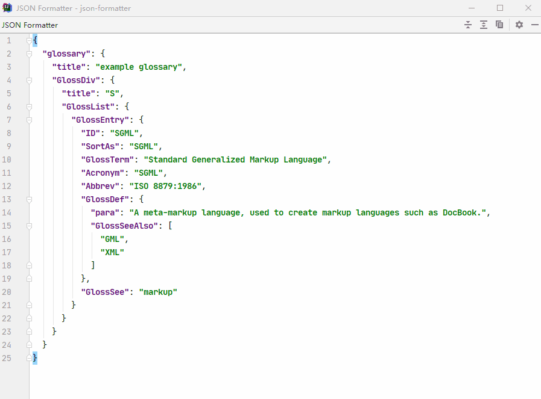

JSON Format Plugin
=================

[![License][license-img]][license]

[license-img]: https://img.shields.io/github/license/chocolate213/json-formatter?style=flat-square
[license]: https://github.com/chocolate213/json-formatter/blob/master/LICENSE

<!-- Plugin description -->
### JetBrains IDE/Android Studio JSON Formatter Plugin

**Format**, **Minify**, **Verify** JSON as if you edit a file with <code>.json</code> suffix.

### Usage
Paste JSON string into the editor, and press **Reformat Code** (Ctrl + Alt + L in windows) to format code as if you edit a file with .json suffix.
<!-- Plugin description end -->