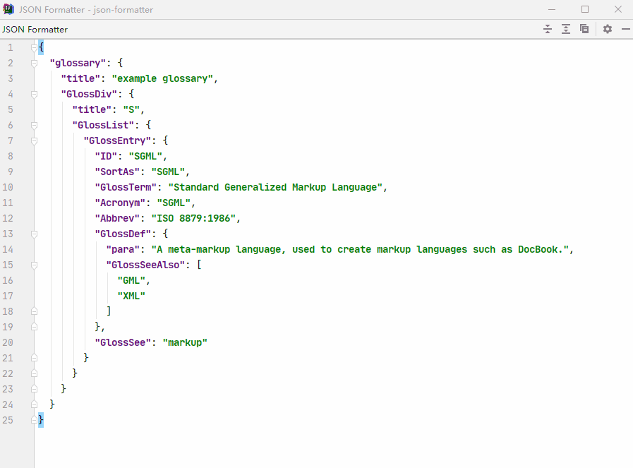

# JSON Formatter

<!-- Plugin description -->
Format, minify, validate, escape, and unescape JSON **without leaving your IDE or creating a temporary file**.

A dedicated tool window for JetBrains IDEs and Android Studio, with syntax highlighting, code folding, and one-click copying.
<!-- Plugin description end -->

[Install from Marketplace](https://plugins.jetbrains.com/plugin/13931-json-formatter) · [Interactive demo](https://chocolate213.github.io/json-formatter/) · [Usage guide](https://plugins.jetbrains.com/plugin/13931-json-formatter/usage-guide)

## Quick start

1. Install **Json Formatter** from **Settings → Plugins → Marketplace**.
2. Open **View → Tool Windows → JSON Formatter** and paste your JSON.
3. Choose **Expand Json** to format it, or use the other header actions to minify, validate, escape, unescape, and copy. Hover over an icon to see its name.

You can also use **Reformat Code** with focus in the JSON editor: `Ctrl+Alt+L` on Windows or `⌘⌥L` on macOS with the default keymap.

## Feedback

[Report a bug or request a feature](https://github.com/chocolate213/json-formatter/issues). Include your IDE and plugin versions and a small anonymized example.

## License

[MIT](LICENSE)
